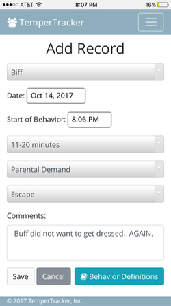
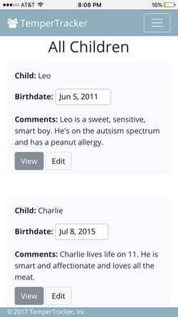

# TemperTracker

TemperTracker is a tool for parents and Pediatric Behavioral Therapists to facilitate the collection, tabulation and display of behavioral data over time.

###### TemperTracker is LIVE at [https://daniel-certa-1228.github.io/Temper-Tracker/](https://daniel-certa-1228.github.io/Temper-Tracker/).

If a child’s tantrums are of a frequency and/or severity to the point of impacting a family’s quality of life, a behavioral therapist will ask parents to track a child’s tantrums over a period of time.

I set out to create an app that would be both intuitive and easy-to-use for parents who need to track their child's challenging behavior.

#### Dependencies
* Bootstrap 4 (Beta)
* AngularJS
* ChartJS
* Angular-ChartJS
* Firebase

#### To Run:

* Fork and Clone this repo
* cd into the 'lib' folder and run <code>npm-install</code>
* Run <code>grunt</code> to compile the CSS and JS files
